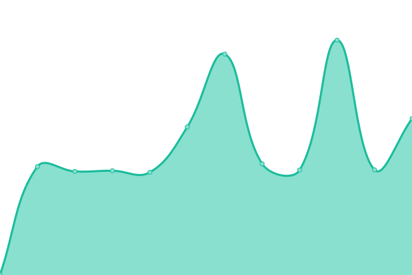
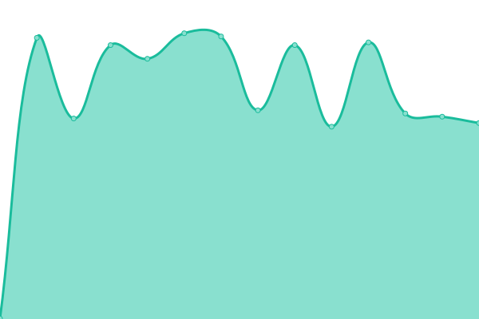
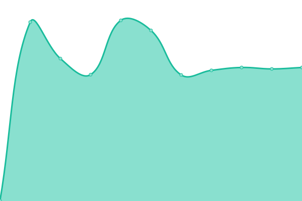
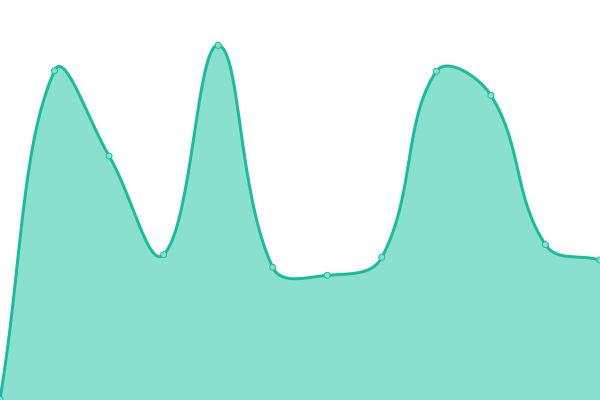

# [📈 Live Status](https://demo.upptime.js.org): <!--live status--> **🟩 All systems operational**

This repository contains the open-source uptime monitor and status page for [InContext Solutions](http://www.incontextsolutions.com/), powered by [Upptime](https://github.com/upptime/upptime).

With [Upptime](https://upptime.js.org), you can get your own unlimited and free uptime monitor and status page, powered entirely by a GitHub repository. We use [Issues](https://github.com/InContextSolutions/status.shoppermx.com/issues) as incident reports, [Actions](https://github.com/InContextSolutions/status.shoppermx.com/actions) as uptime monitors, and [Pages](https://demo.upptime.js.org) for the status page.

<!--start: status pages-->
<!-- This summary is generated by Upptime (https://github.com/upptime/upptime) -->
<!-- Do not edit this manually, your changes will be overwritten -->
<!-- prettier-ignore -->
| URL | Status | History | Response Time | Uptime |
| --- | ------ | ------- | ------------- | ------ |
|  [Public Website](https://www.incontextsolutions.com) | 🟩 Up | [public-website.yml](https://github.com/InContextSolutions/status.shoppermx.com/commits/HEAD/history/public-website.yml) | 

 867ms
     
 | 

<a href="https://status.shoppermx.com/history/public-website">100.00%</a>
    

|  [ShopperMX](https://www.shoppermx.com) | 🟩 Up | [shopper-mx.yml](https://github.com/InContextSolutions/status.shoppermx.com/commits/HEAD/history/shopper-mx.yml) | 

 520ms
     
 | 

<a href="https://status.shoppermx.com/history/shopper-mx">100.00%</a>
    

|  [My ShopperMX](https://my.shoppermx.com) | 🟩 Up | [my-shopper-mx.yml](https://github.com/InContextSolutions/status.shoppermx.com/commits/HEAD/history/my-shopper-mx.yml) | 

 477ms
     
 | 

<a href="https://status.shoppermx.com/history/my-shopper-mx">100.00%</a>
    

|  [Help Site](https://help.shoppermx.com) | 🟩 Up | [help-site.yml](https://github.com/InContextSolutions/status.shoppermx.com/commits/HEAD/history/help-site.yml) | 

 1327ms
     
 | 

<a href="https://status.shoppermx.com/history/help-site">100.00%</a>
    

|  [EveryMan API](https://everyman.shoppermx.com) | 🟩 Up | [every-man-api.yml](https://github.com/InContextSolutions/status.shoppermx.com/commits/HEAD/history/every-man-api.yml) | 

 594ms
     
 | 

<a href="https://status.shoppermx.com/history/every-man-api">100.00%</a>
    

|  [PlayerInfoService API](https://prod-incontext-playerinfoservice-webapi.azurewebsites.net) | 🟩 Up | [player-info-service-api.yml](https://github.com/InContextSolutions/status.shoppermx.com/commits/HEAD/history/player-info-service-api.yml) | 

 1012ms
     
 | 

<a href="https://status.shoppermx.com/history/player-info-service-api">100.00%</a>
    

|  [OIDC / SSO](https://sso.shoppermx.io/version) | 🟩 Up | [oidc-sso.yml](https://github.com/InContextSolutions/status.shoppermx.com/commits/HEAD/history/oidc-sso.yml) | 

 571ms
     
 | 

<a href="https://status.shoppermx.com/history/oidc-sso">100.00%</a>
    

|  [HeartbeatService API](https://prod-heartbeat.shoppermx.com/) | 🟩 Up | [heartbeat-service-api.yml](https://github.com/InContextSolutions/status.shoppermx.com/commits/HEAD/history/heartbeat-service-api.yml) | 

 501ms
     
 | 

<a href="https://status.shoppermx.com/history/heartbeat-service-api">100.00%</a>
    

|  [Identity API](https://identity.shoppermx.com/Service.svc) | 🟩 Up | [identity-api.yml](https://github.com/InContextSolutions/status.shoppermx.com/commits/HEAD/history/identity-api.yml) | 

 485ms
     
 | 

<a href="https://status.shoppermx.com/history/identity-api">100.00%</a>
    

|  [Ops Dashboard](https://ops.shoppermx.io) | 🟩 Up | [ops-dashboard.yml](https://github.com/InContextSolutions/status.shoppermx.com/commits/HEAD/history/ops-dashboard.yml) | 

 321ms
     
 | 

<a href="https://status.shoppermx.com/history/ops-dashboard">100.00%</a>
    

<!--end: status pages-->

[**Visit our status website →**](https://status.shoppermx.com)

## 📄 License

- Powered by: [Upptime](https://github.com/upptime/upptime)
- Code: [MIT](./LICENSE) © [Anand Chowdhary](https://anandchowdhary.com), supported by [Pabio](https://pabio.com)
- Data in the `./history` directory: [Open Database License](https://opendatacommons.org/licenses/odbl/1-0/)
